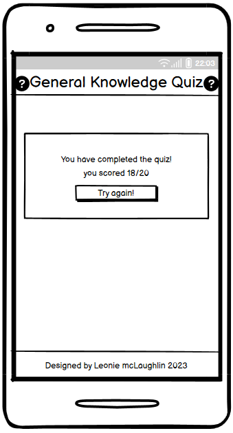

# General Knowledge Quiz

This is a fun interactive quiz game designed for all users that would like to test their general knowledge. The quiz consists of Twenty questions and the user has Fifteen seconds to answer each question. Different categories of questions is displayed to the user and at the end of the quiz they will receive a final score out of Twenty. This quiz was designed with the user in mind and supplies information to the user such as their current score, which question they are on and the correct answer to the question if they get it wrong. The purpose of this quiz is to have fun while also learning some new trivia.

A live version of the project can be accessed here: [General Knowledge Quiz](https://leoniemclaughlin7.github.io/general-knowledge-quiz/)

# Table Of Contents

* [User Experience Design](#user-experience-design)
  * [User Demographic](#user-demographic)
  * [User Stories](#user-stories)
  * [Wireframes](#wireframes)
    * [Desktop](#desktop)
    * [Mobile](#mobile)
  * [Design](#design)
    * [Colours](#colours)
    * [Typography](#typography)
* [Features](#features)
  * [Existing Features](#existing-features)
    * [Header and Logo](#header-and-logo)
    * [Rules area](#rules-area)
    * [Quiz area](#quiz-area)
    * [Result area](#result-area)
    * [Footer](#footer)
  * [Features Left to Implement](#features-left-to-implement)
* [Testing](#testing)
  * [Header and Logo](#header-and-logo-1)
  * [Rules area](#rules-area-1)
  * [Quiz area](#quiz-area-1)
  * [Result area](#result-area-1)
  * [Footer](#footer-1)
  * [Validator Testing](#validator-testing)
    * [HTML](#html)
    * [CSS](#css)
    * [Lighthouse Testing](#lighthouse-testing)
* [known Bugs](#known-bugs)
* [Deployment](#deployment)
* [Credits](#credits)
  * [Images](#images)
  * [Content](#content)
  * [Code](#code)
* [Acknowledgements](#acknowledgements)

# User Experience Design

## User Demographic

This website is intended for:

* Users that have a keen interest in general knowledge.
* Users that would like to play a fun interactive quiz.
* Users that wish to test their general knowledge.  

## User Stories

As a User of this website:

* I want to play a fun quiz.
* I want to test my general knowledge.
* I want to learn some new facts and trivia.

## Wireframes

Wireframes were produced for the rules area, quiz area and result area on both desktop and mobile. Some aspects of the wireframes have changed as the website was being produced.

### Desktop

### Mobile

## Design

The objective of this project was to design a quiz website that is easy to use, provides good feedback to the user and has a clean layout. A theme can be seen through this website, this was achieved by use of a colourful background and a range of different colours in the design.  

### Colours

The colour palette for this quiz website was  created by [Coolors.](https://coolors.co/) This colour palette was chosen as it complements the background and is consistent with the theme of the quiz. It consists of vibrant, however muted colours that give a retro feel to this quiz game.  

### Typography

The fonts for the site where imported from Google fonts. For the logo [Lora](https://fonts.google.com/specimen/Lora?query=Lora) was used. This font was chosen as it fit the aesthetic of the site, is readable and clear for the user. For the main content [Roboto](https://fonts.google.com/specimen/Roboto) was used. This font was chosen as it complements the logo whilst also being clean and easy to read for the user. Both fonts also have a second font of Serif and Sans-Serif set as a backup font.

[Back to top](#general-knowledge-quiz)

# Features

The general knowledge quiz site contains three main sections.  The main section is the quiz area which houses the most features. Each section will be described in detail below. The three main sections in this design are:

* Rules area.  
* Quiz area.
* Result area.

## Existing Features

### Header and Logo

* Featured throughout the site, the header contains a clickable logo, that will return the user to the rules area, which contains the start quiz button, at any point during the quiz game.

### Rules area

* The rules area describes to the user how to play the quiz game.
* It contains the start quiz button which navigates the user to the first question of the general knowledge quiz.

### Quiz area

* The quiz area contains a countdown timer for each question. The user is given Fifteen seconds to answer each question.
* The next feature evident is the the category section. Each question is giving a category and this changes depending on the question being asked.
* There is a question area in which the question is posed to the user.
* The answer section comprises of Four answer buttons containing the possible answers.  Each answer button has a hover effect when the user hovers over the button.
* A question counter is present to provide feedback to the user to make them aware of which question they are on.
* A score area is also present. If the player gets a question right their score will increment and they can keep track of their current score.

* If the timer reaches Zero or the user chooses the correct answer, it will be highlighted in green to the user.
* All answer buttons will loose their hover effect and become disabled, so the player cannot choose another answer.
* A next question button with a hover effect will appear to the player to encourage them to move onto the next question.

* If the player chooses an incorrect answer, the answer they chose will be highlighted in red and the correct answer will be highlighted in green.
* As with the timer reaching Zero and the player choosing the correct answer, all answer buttons will be disabled and the next question button will appear.

### Result area

* When the player finishes the quiz they are directed to the result area.
* In this area they are informed that they have completed the quiz and their score out of Twenty is displayed.
* A button to restart the quiz is also evident, which will navigate the player back to the first question of the quiz.

### Footer

* A footer is evident to the user throughout the quiz game.
* It is styled similar to the header and contains a link to my GitHub.

## Features Left to Implement

* A leader board could be implemented to save the players scores.
* A scoring system based on how fast the user answers the question would be a nice addition to have.
* A way of having the questions change after a period of time could be implemented, to ensure the player can have a go at different questions.
* A sign in could be implemented so players can sign in to the site and see their previous scores.

[Back to top](#general-knowledge-quiz)

# Testing

Testing of the functionality of the website can be seen in the following tables. The testing was carried out on the deployed site. Each section of the website has been tested according to the feature. Testing of different devices and screen resolutions has been conducted using Google DevTools.

### Header and Logo

|Feature  | Expect  | Action | Result |
|--|--|--|--|
| Logo  | When the logo is clicked it will return the user to the rules area |Click logo at different points in quiz | pass
| Header is responsive| Header will fit the length of screen on different screen sizes down to a width of 320px | Resize the browser and checked the header at different resolutions | pass
| Logo is responsive| Logo will change in size to fit different screen widths | Resize the browser and checked the logo at different resolutions| pass

### Rules area

|Feature | Expect | Action | Result |
|--|--|--|--|
| Rules area is responsive| Rules area will change to fit the screen size, down to 320px width and 555px height | Resize the browser and checked the rules area at different resolutions | pass
| Start quiz button hover| A hover effect can be seen on the start quiz button when hovered over with mouse | Hover over start quiz button | pass
| Start quiz button clickable| Once clicked the start quiz button will navigate the player to the first question of the quiz | Click the start quiz button| pass

### Quiz area

|Feature | Expect | Action | Result |
|--|--|--|--|
| Timer | Timer will countdown from Fifteen for each question | Click either the start quiz or next question button, note the timer at Fifteen seconds counting down| pass
|Category| Category will change depending on the question being asked | Check that the category changes when the question changes | pass
| Answer buttons hover| A hover effect can be seen on the answer buttons when hovered over with mouse | Hover over answer buttons | pass
| Answer buttons - correct answer| If the player chooses the correct answer the answer will be highlighted in green | Click the correct answer| pass
| Answer buttons - incorrect answer| If the player chooses the incorrect answer the correct answer will be highlighted in Green and the incorrect answer in Red | Clicked the incorrect answer| pass
| Answer buttons remove hover| Once an answer has been chosen the hover effect will be removed from the answer buttons | Click an answer| pass
| Next question button| Once an answer has been chosen or the timer runs out the next question button will appear | Click an answer or let timer run to Zero| pass
| Next question button hover| A hover effect can be seen on the next question button when hovered over with mouse | Hover over next question button | pass
| Next question button clickable| Once clicked the next question button will display the next question to the player | Click the next question button | pass
| Quiz area responsive | Quiz area will change to fit the screen size, down to 320px width and 530px height | Resize the browser and checked the quiz area at different resolutions | pass

### Result area

|Feature | Expect | Action | Result |
|--|--|--|--|
| Result area is responsive| Result area will change to fit the screen size, down to 320px width | Resize the browser and checked the result area at different resolutions | pass
|Score| Players score is displayed correctly corresponding to the score achieved | Test different scores and checked with the score output | pass
| Try again button hover| A hover effect can be seen on the try again button when hovered over with mouse | Hover over try again button | pass
| Try again button clickable| Once clicked the try again button will navigate the player to the first question of the quiz | Click the try again button| pass

### Footer

|Feature | Expect | Action | Result |
|--|--|--|--|
| GitHub link clickable | When clicked the GitHub icon will open a new window to my GitHub repository | Click the GitHub icon| pass
| Footer responsive | Footer will fit the screen size, down to 320px width| Resized the browser and checked the footer at different resolutions | pass

## Validator Testing

### HTML

No errors were returned when the site was passed through the official [W3C Validator](https://validator.w3.org/nu/?doc=https%3A%2F%2Fleoniemclaughlin7.github.io%2Fgeneral-knowledge-quiz%2F)

### CSS

No errors were returned when the site was passed through the official [Jigsaw validator](https://jigsaw.w3.org/css-validator/validator?uri=https%3A%2F%2Fleoniemclaughlin7.github.io%2Fgeneral-knowledge-quiz%2F&profile=css3svg&usermedium=all&warning=1&vextwarning=&lang=en)

### Lighthouse Testing

# known Bugs

All known bugs have been fixed, below is a list of bugs encountered and how they have been fixed.

|Bug  | Status | Solution  |
|--|--|--|
|Could not position elements that had a height or width attribute with flexbox | fixed| Needed to wrap these elements in a div and position that div with flexbox
|Section lacking heading| fixed| Changed the section to a div. This was a warning highlighted by the W3C validator
|Problem using for loop with event listener in getAnswer function| fixed| Resolved by calling the event listener outside function and removing unnecessary parameters
|When the height of the screen was reduced the start quiz and next question buttons where inaccessible| fixed |Resolved with the used of a media query with the max-height attribute
|Timer would not reset to Fifteen seconds on a new question| fixed |Resolved by resetting the timer to Fifteen in the setTimer function and nesting the runTimer function inside setTimer
|Disabled answers had a greyed out appearance| fixed |Using some simple CSS by targeting the disabled buttons and setting the colour to initial resolved this
|Using event listeners by class name| fixed |It was important to remember that in order to use an event listener by class name the elements in the class needed to be looped through
|Question counter could not be implemented using the variable questionCounter as it was counting from Zero| fixed |A new key pair was implemented in the quizQuestion object called count, this was used to display the question count to the player

# Deployment

The site was deployed to GitHub pages. The steps to deploy are as follows:

1. Navigate to GitHub.
2. Choose the desired GitHub repository.
3. Select settings from the top menu bar.
4. On the left hand side, under the code and automation section, choose pages.
5. Under the build and deployment heading, set branch as main and click save.
6. The website will deploy, a link to the project will be seen at the top of the page.

The live link can be accessed here: [General Knowledge Quiz](https://leoniemclaughlin7.github.io/general-knowledge-quiz/)

# Credits

### Images

* [Background image](https://i0.wp.com/www.additudemag.com/wp-content/uploads/2016/11/2267.jpg?resize=1280%2C720px&ssl=1)

### Content

* [Multiple choice questions](https://travelswithelle.com/other/multiple-choice-trivia-questions/)

### Code

* [Help with timer](<https://stackoverflow.com/questions/44314897/javascript-timer-for-a-quiz>)
* [Zenva - Creating a Basic Quiz - JavaScript Tutorial](https://www.youtube.com/watch?v=RswgVWKJRLM)
* [Linear gradient](https://www.w3schools.com/CSSref/func_linear-gradient.php)

# Acknowledgements

I would like to thank my mentor Lauren-Nicole Popich, the Code Institute team and the Slack community.  

[Back to top](#general-knowledge-quiz)
